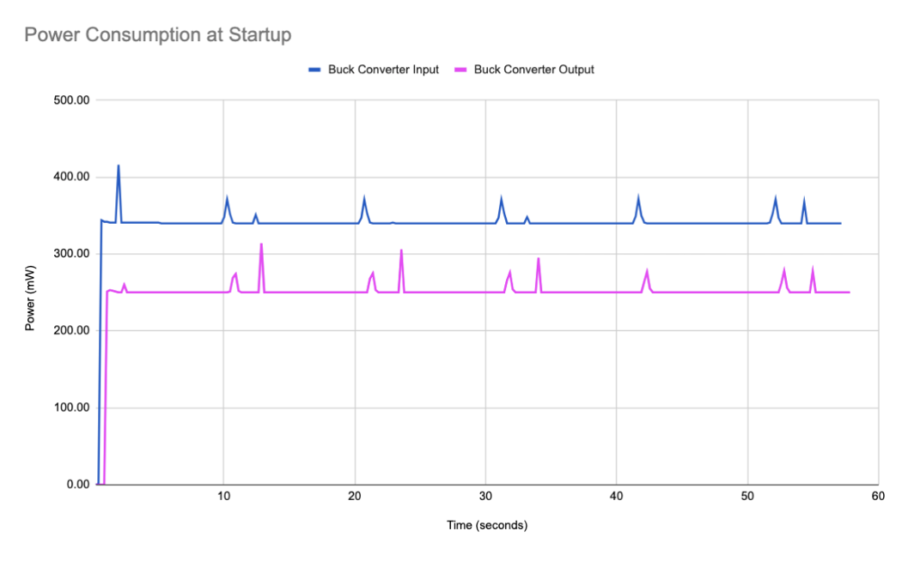
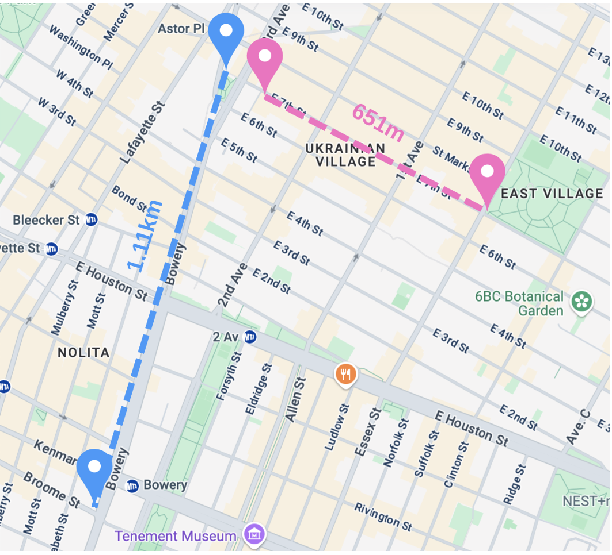
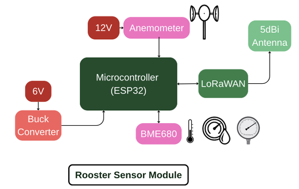
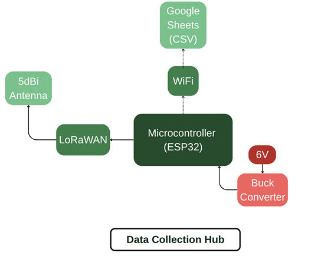
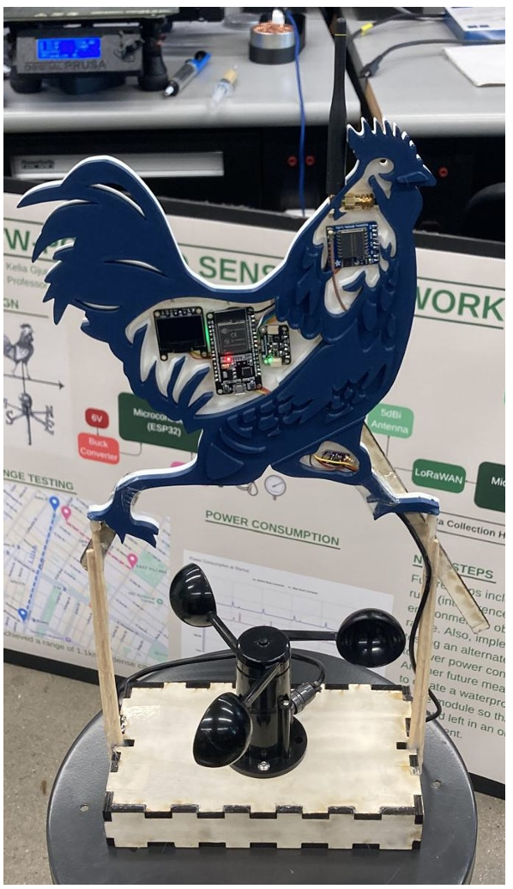

# Field Tests Report

## Power Testing
- **Setup:** Measured power draw at the 6 V battery output and the 5 V buck-converter output; the anemometer powered separately on 12 V.
- **Findings:**
  - Nearly a 100 mW drop across the buck converter (76 % conversion efficiency).
  - Continuous data transmission and OLED display add current draw; implement sleep modes or efficient regulators to save power.

## Range Testing
- **Line-of-Sight (Open Urban):** 1.11 km max reliable range before packet corruption.
- **Dense Urban Interference:** 651 m max reliable range amid traffic and buildings.

## Sensor Data Verification
- **Anemometer:** Output voltage scaled proportionally with fan speed in three test settings.
- **BME680 Sensor:** After 48 h burn-in, temperature, humidity, pressure, and VOC readings stable and within tolerances.
- **OLED Display:** Correctly updates real-time sensor data but is a significant power sink.

## Block Diagrams
          

## Final Sensor Module

